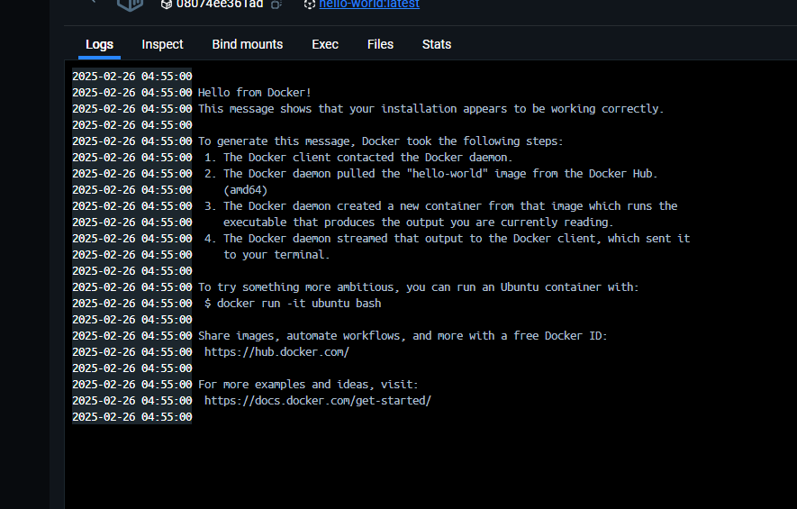
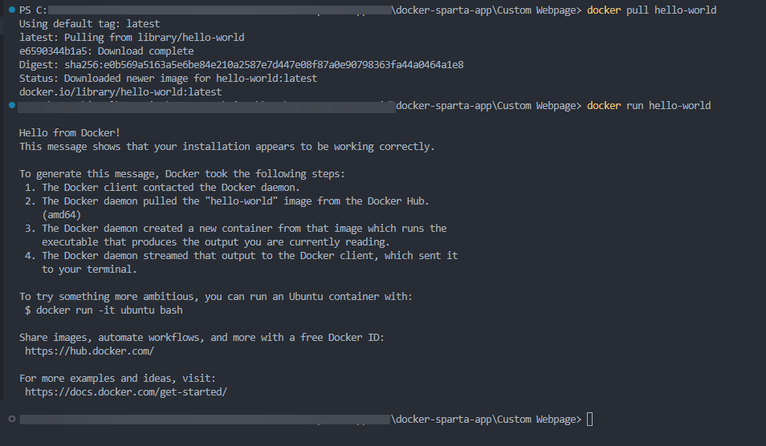
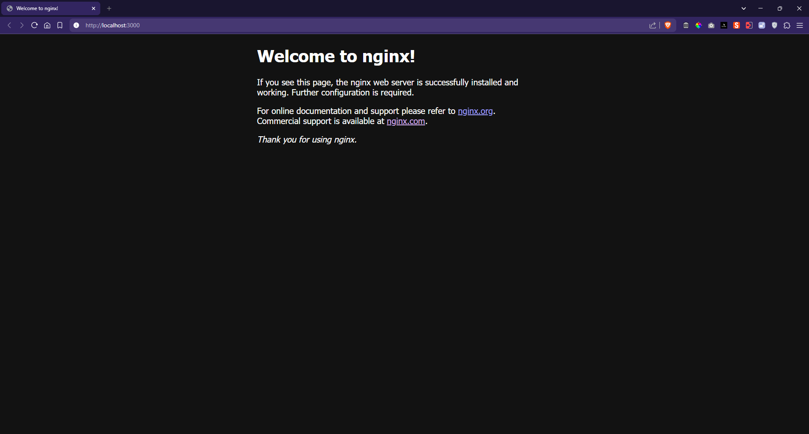
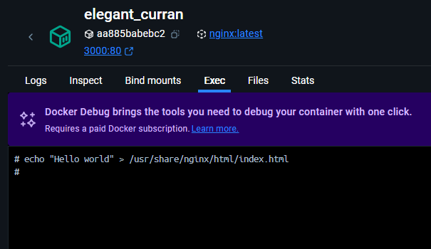
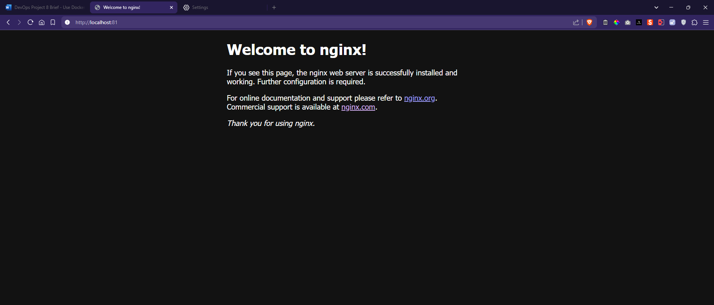
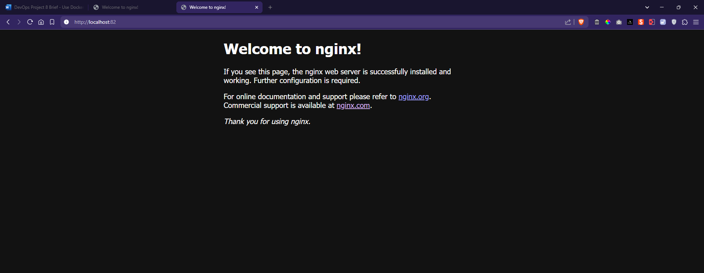

# Setting Up My Docker Environment and Creating a Docker Compose Setup

### Initial Setup
I began by downloading Docker Desktop to my local machine, taking time to thoroughly read through the official Docker documentation to understand the core commands and concepts. This initial learning phase was crucial for my understanding of containerization.

I used the example Dockerfile that Docker provides.



After getting comfortable with the basics, I decided to create my first test Dockerfile project. I started with a simple implementation, writing a Dockerfile that would output "Hello World" using the echo command. 

I then proceeded to build my first Docker image from this file, which familiarized me with the build process. I experimented with the Docker exec command line interface, allowing me to interact with my container directly and execute commands within it.

## Table of Contents
- [Setting Up My Docker Environment and Creating a Docker Compose Setup](#setting-up-my-docker-environment-and-creating-a-docker-compose-setup)
    - [Initial Setup](#initial-setup)
  - [Table of Contents](#table-of-contents)
  - [Tasks](#tasks)
    - [Task: Run and pull your first image](#task-run-and-pull-your-first-image)
    - [Task: Run nginx web server in a Docker container](#task-run-nginx-web-server-in-a-docker-container)
    - [Task: Remove a container](#task-remove-a-container)
    - [Task: Modify our nginx default page in our running container](#task-modify-our-nginx-default-page-in-our-running-container)
    - [Task: Run different container on different port](#task-run-different-container-on-different-port)
    - [Use Docker Hub to host custom images](#use-docker-hub-to-host-custom-images)
    - [Task: Push host-custom-static-webpage container image to Docker Hub](#task-push-host-custom-static-webpage-container-image-to-docker-hub)
    - [Task: Automate docker image creation using a Dockerfile](#task-automate-docker-image-creation-using-a-dockerfile)
    - [Task: Run Sparta test app in a container](#task-run-sparta-test-app-in-a-container)
    - [Task: Research Docker Compose](#task-research-docker-compose)
    - [Task: Use Docker Compose to run app and database containers](#task-use-docker-compose-to-run-app-and-database-containers)
  - [Blockers/Challenges](#blockerschallenges)
  - [Additional Development Notes](#additional-development-notes)


## Tasks

### Task: Run and pull your first image
I started by pulling and running my first Docker image using the hello-world image:
```
docker pull hello-world
docker run hello-world
```



### Task: Run nginx web server in a Docker container
I ran the Nginx official image from the Docker Hub. I discovered that, in order to work, it needs to be run with port 80 specifically.

```docker run -d -p 80:80 nginx```

I verified it was working by visiting localhost:80 in my browser.



### Task: Remove a container
I learned how to manage container lifecycle by stopping and removing containers:

```
docker ps # to get container ID
docker stop <container-id>
docker rm <container-id>
```

### Task: Modify our nginx default page in our running container
I practiced container interaction by modifying the nginx welcome page:
```
docker exec -it <container-id> bash
echo "hello world" > /usr/share/nginx/html/index.html
```




### Task: Run different container on different port
I experimented with running multiple nginx instances on different ports:
```
docker run -d -p 81:80 nginx
docker run -d -p 82:80 nginx
```




### Use Docker Hub to host custom images
I created a Docker Hub account and learned about image repositories. This prepared me for pushing my own images.

### Task: Push host-custom-static-webpage container image to Docker Hub
I created a custom webpage container and pushed it to Docker Hub:
```
docker build -t myusername/static-webpage .
docker push myusername/static-webpage
```

### Task: Automate docker image creation using a Dockerfile
I created my first Dockerfile for the sparta app:
```
FROM node:12
WORKDIR /app
COPY . .
RUN npm install
EXPOSE 3000
CMD ["npm", "start"]
```

### Task: Run Sparta test app in a container
I containerized the sparta test app using my Dockerfile:
```
FROM ubuntu:20.04

EXPOSE 3000
ENV PORT=3000

# Prevent interactive prompts during package installation
ENV DEBIAN_FRONTEND=noninteractive
ENV DB_HOST=mongodb://localhost:27017/posts

# Install essential packages
RUN apt-get update && apt-get install -y \
    curl \
    wget \
    git \
    nginx \
    sudo \
    gnupg \
    apt-transport-https \
    ca-certificates \
    && rm -rf /var/lib/apt/lists/*

# Install Node.js
RUN curl -fsSL https://deb.nodesource.com/setup_current.x | bash - \
    && apt-get install -y nodejs

# Install NVM
ENV NVM_DIR=/usr/local/nvm
ENV NODE_VERSION=20.16.0
RUN mkdir -p $NVM_DIR \
    && curl -o- https://raw.githubusercontent.com/nvm-sh/nvm/v0.39.0/install.sh | bash \
    && . $NVM_DIR/nvm.sh \
    && nvm install $NODE_VERSION \
    && nvm use $NODE_VERSION

# Install MongoDB
RUN wget -qO - https://www.mongodb.org/static/pgp/server-6.0.asc | apt-key add - \
    && echo "deb [ arch=amd64,arm64 ] https://repo.mongodb.org/apt/ubuntu focal/mongodb-org/6.0 multiverse" | tee /etc/apt/sources.list.d/mongodb-org-6.0.list \
    && apt-get update \
    && wget http://archive.ubuntu.com/ubuntu/pool/main/o/openssl/libssl1.1_1.1.1f-1ubuntu2_amd64.deb \
    && dpkg -i libssl1.1_1.1.1f-1ubuntu2_amd64.deb \
    && apt-get install -y mongodb-org \
    && rm libssl1.1_1.1.1f-1ubuntu2_amd64.deb \
    && mkdir -p /data/db

# Install PM2 globally
RUN npm install -g pm2

# Clone the repository
WORKDIR /app
RUN git clone https://github.com/AmeenahRiffin/tech501-sparta-app/

# Set up the application
WORKDIR /app/tech501-sparta-app/app

CMD ["sh", "-c", "mongod & service nginx start & npm install && node app.js"]
```

### Task: Research Docker Compose
I studied Docker Compose documentation to understand multi-container deployments and YAML configuration. This is available in the [Docker Research](Docker_Research.md) file.

### Task: Use Docker Compose to run app and database containers
I created a docker-compose.yml to run both the app and MongoDB:
```
# Use Ubuntu as base image
FROM ubuntu:20.04

# Avoid prompts during package installation
ENV DEBIAN_FRONTEND=noninteractive
ENV PORT=3000
ENV DB_HOST=mongodb://localhost:27017/posts

# Expose ports
EXPOSE 27017
EXPOSE 3000

# Install necessary packages, MongoDB, and Node.js
RUN apt-get update && \
    apt-get install -y wget gnupg curl git nginx sudo apt-transport-https ca-certificates && \
    wget -qO - https://www.mongodb.org/static/pgp/server-6.0.asc | apt-key add - && \
    echo "deb [ arch=amd64,arm64 ] https://repo.mongodb.org/apt/ubuntu focal/mongodb-org/6.0 multiverse" | tee /etc/apt/sources.list.d/mongodb-org-6.0.list && \
    apt-get update && \
    wget http://archive.ubuntu.com/ubuntu/pool/main/o/openssl/libssl1.1_1.1.1f-1ubuntu2_amd64.deb && \
    dpkg -i libssl1.1_1.1.1f-1ubuntu2_amd64.deb && \
    apt-get install -y mongodb-org && \
    rm libssl1.1_1.1.1f-1ubuntu2_amd64.deb && \
    curl -fsSL https://deb.nodesource.com/setup_current.x | bash - && \
    apt-get install -y nodejs && \
    rm -rf /var/lib/apt/lists/*

# Configure MongoDB to accept connections from any IP
RUN sed -i "s/bindIp: 127.0.0.1/bindIp: 0.0.0.0/" /etc/mongod.conf

# Create directory for MongoDB data
RUN mkdir -p /data/db

# Install NVM
ENV NVM_DIR=/usr/local/nvm
ENV NODE_VERSION=20.16.0
RUN mkdir -p $NVM_DIR \
    && curl -o- https://raw.githubusercontent.com/nvm-sh/nvm/v0.39.0/install.sh | bash \
    && . $NVM_DIR/nvm.sh \
    && nvm install $NODE_VERSION \
    && nvm use $NODE_VERSION

# Install PM2 globally
RUN npm install -g pm2

# Clone the repository
WORKDIR /app
RUN git clone https://github.com/AmeenahRiffin/tech501-sparta-app/

# Set up the application
WORKDIR /app/tech501-sparta-app/app

# Start MongoDB, nginx, and the Node.js application
CMD ["sh", "-c", "mongod & service nginx start & npm install && node app.js"]
```
Then launched it with:
```
docker-compose up -d
```

It was successful, as can be seen in the video below:

<video controls src="images/app_and_db.mp4" title=""></video>

## Blockers/Challenges

- Initially struggled with MongoDB connectivity - solved by proper environment variable configuration
- Had to figure out the correct way to persist MongoDB data using volumes
- Learned that service naming is case-sensitive in docker-compose
- PM2 launching required specific configuration in the Dockerfile (Under CMD, not RUN)

## Additional Development Notes

I created an automation script to make the deployment process smoother for my sparta app and database. This was not part of the project, but an experiemental feature I thought of if I were to have a user launch the app on their own PC.

The intent of me making this was because I kept debugging my sparta app, and it made the process a lot quicker for me.

How it works:

1. A script to check if containers are running
2. Database verification
3. App checks
4. Browser launch automation

Sample Output when running the setup:
```
Verifying Database...
[+] Running 2/2
  ✔ Network mongodb_default        Created                                                                         0.1s
  ✔ Container mongodb             Started                                                                         0.5s
Verifying App...
[+] Running 2/2
  ✔ Network sparta-app_default    Created                                                                         0.0s
  ✔ Container sparta-app         Started                                                                          0.4s
Waiting for app to start...

```